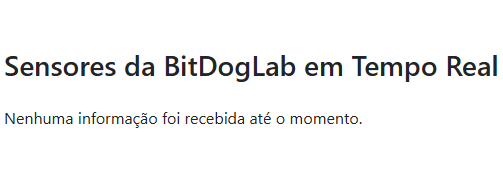
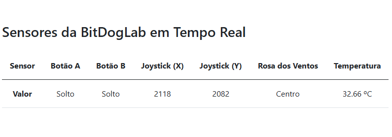

# Aplicações com comunicação sem fio para IoT

## Unidade 2 / Capítulo 3

### Objetivo

- Desenvolver aplicações IoT utilizando microcontroladores e protocolos de comunicação.
- Realizar práticas de aplicações IoT.

### Enunciado

**Leitura dos status dos botões da placa BitDogLab, para que seja visualizado em um servidor:**

- Com base no código apresentado na aula do capítulo 3, da unidade 2, crie um programa para monitorar os status do botão da placa e enviar, a cada 1 segundo, os status para um servidor. Além disso, como um desafio extra, acrescente algum sensor e envie a informação desse sensor para o servidor.

**Leitura da posição do joystick da placa Bitdoglab, para que seja visualizado em um servidor:**

- Com base no código apresentado na aula do capítulo 3, da unidade 2, crie um programa para ler a posição do joystick e enviar a posição X e Y para um servidor via Wi-Fi. Além disso, como um desafio extra, crie uma rosa dos ventos imaginaria e envie para o aplicativo a posição (Norte, Sul, Leste, Oeste, Nordeste, Sudeste, Noroeste e Sudoeste) selecionada no joystick.

**Questão desafio:**

- **Servidor na nuvem:** Refaça as tarefas anteriores, utilizando um servidor na nuvem, como por exemplo: AWS, Google e entre outros.

### Tecnologias

Para desenvolver o servidor para se comunicar com a BitDogLab, foram utilizadas as seguintes tecnologias:

| Tecnologia  | Descrição                                                    |
| ----------- | ------------------------------------------------------------ |
| Python      | Linguagem de Programação.                                    |
| FastAPI     | Framework em Python para construir de APIs baseadas em HTTP. |
| Uvicorn     | Servidor ASGI para executar aplicações FastAPI.              |
| HTML        | Linguagem de Marcação de Hipertexto.                         |
| JavaScript  | Linguagem de Programação.                                    |
| Bootstrap 5 | Framework front-end para contruir interfaces.                |

### Executando a aplicação embarcada

No arquivo ```main.c```, realize as configurações necessárias:

- Defina o SSID (nome) da sua rede Wi-Fi, na constante ```WIFI_SSID```.
- Defina a senha da sua rede Wi-Fi, na constante ```WIFI_PASSWORD```.
- Defina o IPV4 do seu computador ou servidor que esteja executando a aplicação web, na constante ```SERVER_IP```.

Por fim, compile a aplicação no VSCode com a extensão Raspberry Pi Pico.

### Executando a aplicação web

Com o Git instalado, clone o repositório da aplicação:

~~~console
foo@bar:~$ git clone https://github.com/lucapwn/EmbarcaTech.git
~~~

Com o Python instalado, navegue até o diretório ```/api``` e crie um ambiente virtual:

~~~console
foo@bar:~$ python -m venv .venv
~~~

Ative o ambiente virtual:

~~~console
foo@bar:~$ .\.venv\Scripts\activate
~~~

Instale as dependências:

~~~console
foo@bar:~$ pip install fastapi uvicorn jinja2
~~~

Execute o servidor da aplicação:

~~~console
foo@bar:~$ uvicorn main:app --host 0.0.0.0 --port 80 --reload
~~~

Agora você poderá acessar a aplicação no navegador em:

~~~console
http://localhost
~~~

### Exemplo da aplicação

A Figura 1 ilustra a aplicação aguardando o recebimento das informações da BitDogLab.



A Figura 2 ilustra a aplicação em funcionamento recebendo os dados da BitDogLab a cada 1 segundo e exibindo em tempo real para o usuário.



### Autor

Desenvolvido por [Lucas Araújo](https://github.com/lucapwn).
