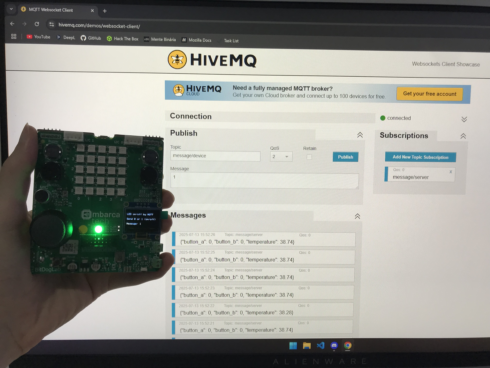
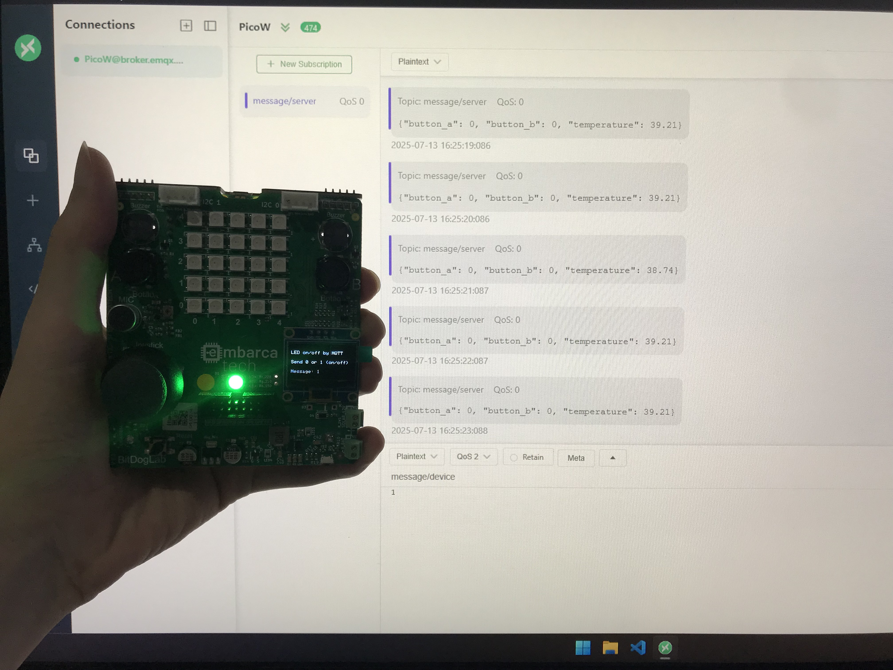

# Aplicações com comunicação sem fio para IoT

## Unidade 2 / Capítulo 3

### Objetivo

- Desenvolver aplicações IoT utilizando microcontroladores e protocolos de comunicação.
- Realizar práticas de aplicações IoT.

### Enunciado

**Leitura do status de um pino da placa BitDogLab, para que seja visualizado em um servidor:**

- Utilizando a placa BitDogLab, crie um programa para monitorar o status de um pino, que possa ser definido como entrada, da placa BitDogLab, e enviar, a cada 1 segundo, o status atual para o servidor HiveMQ, utilizando o protocolo MQTT. Além disso, como desafio extra, acrescente algum sensor e envie a informação desse sensor para o servidor.

**Recebimento de dados via servidor:**

- Utilizando a placa BitDogLab, crie um programa para receber dados do servidor HiveMQ, utilizando o protocolo MQTT. Os dados recebidos devem ligar ou desligar um LED, que deve ser ligado a placa. Além disso, como desafio extra, implemente um LCD ou outro tipo de display para monitorar o recebimento de mensagens.

**Questão desafio:**

- **Servidor na nuvem:** Refaça as tarefas anteriores, utilizando outro servidor MQTT, como por exemplo: AWS, Google, MQTTX e entre outros.

### Tecnologias

Para desenvolver a aplicação e permitir a comunicação bidirecional entre o servidor e a BitDogLab, foram adotadas as seguintes tecnologias:

| Tecnologia   | Descrição                                                                             |
| ------------ | ------------------------------------------------------------------------------------- |
| C            | Linguagem de programação do firmware da aplicação.                                    |
| MQTT         | Protocolo de comunicação eficiente para dispositivos IoT.                             |
| HiveMQ       | Plataforma de streaming de dados IoT. Usada, neste exemplo, como broker MQTT público. |
| MQTTX        | Plataforma de streaming de dados IoT. Usada, neste exemplo, como broker MQTT público. |

### Configurando a aplicação embarcada

No arquivo `include/wifi.h`, defina as credenciais da sua rede Wi-Fi:

- Defina o SSID (nome) da sua rede Wi-Fi, na constante `WIFI_SSID`.
- Defina a senha da sua rede Wi-Fi, na constante `WIFI_PASSWORD`.

No arquivo `include/mqtt.h`, realize as configurações do broker MQTT de sua preferência:

- Defina o host do servidor MQTT, na constante `MQTT_SERVER_HOST`.
- Defina a porta do servidor MQTT, na constante `MQTT_SERVER_PORT`.

Há outras configurações opcionais no arquivo `include/mqtt.h`, realize-as conforme a necessidade. A tabela abaixo exibe as informações sobre os servidores MQTT utilizados nesta aplicação.

| Broker | Host              | Porta | Plataforma                                     |
| ------ | ----------------- | ----- | ---------------------------------------------- |
| HiveMQ | broker.hivemq.com | 1883  | https://www.hivemq.com/demos/websocket-client/ |
| MQTTX  | broker.emqx.io    | 1883  | https://mqttx.app/                             |

Por fim, compile a aplicação no VSCode com a extensão Raspberry Pi Pico.

### Configurando a aplicação MQTT

Escolha o broker MQTT de sua preferência e faça as seguintes configurações:

| Tópico         | Ação      | Descrição                                                                                                            |
| -------------- | --------- | -------------------------------------------------------------------------------------------------------------------- |
| message/server | Subscribe | Recebe as informações dos botões (A e B) e do sensor de temperatura interno do Raspberry Pi Pico W em formato JSON.  |
| message/device | Publish   | Envia uma mensagem para ligar/desligar o LED do Raspberry Pi Pico W. Envie a mensagem `1` (ligar) ou `0` (desligar). |

Se a aplicação embarcada e o servidor MQTT estiverem configurados corretamente, o sistema funcionará conforme as imagens ilustradas na seção abaixo.

### Exemplo da aplicação

A Figura 1 ilustra a aplicação executando na placa BitDogLab e se comunicando com o servidor HiveMQ.

A Figura 2 ilustra a aplicação executando na placa BitDogLab e se comunicando com o servidor MQTTX.

### Autor

Desenvolvido por [Lucas Araújo](https://github.com/lucapwn).
